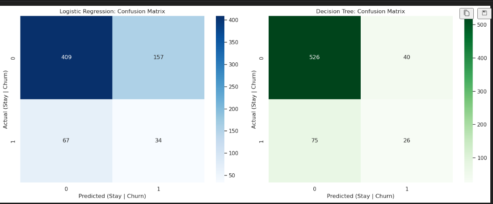
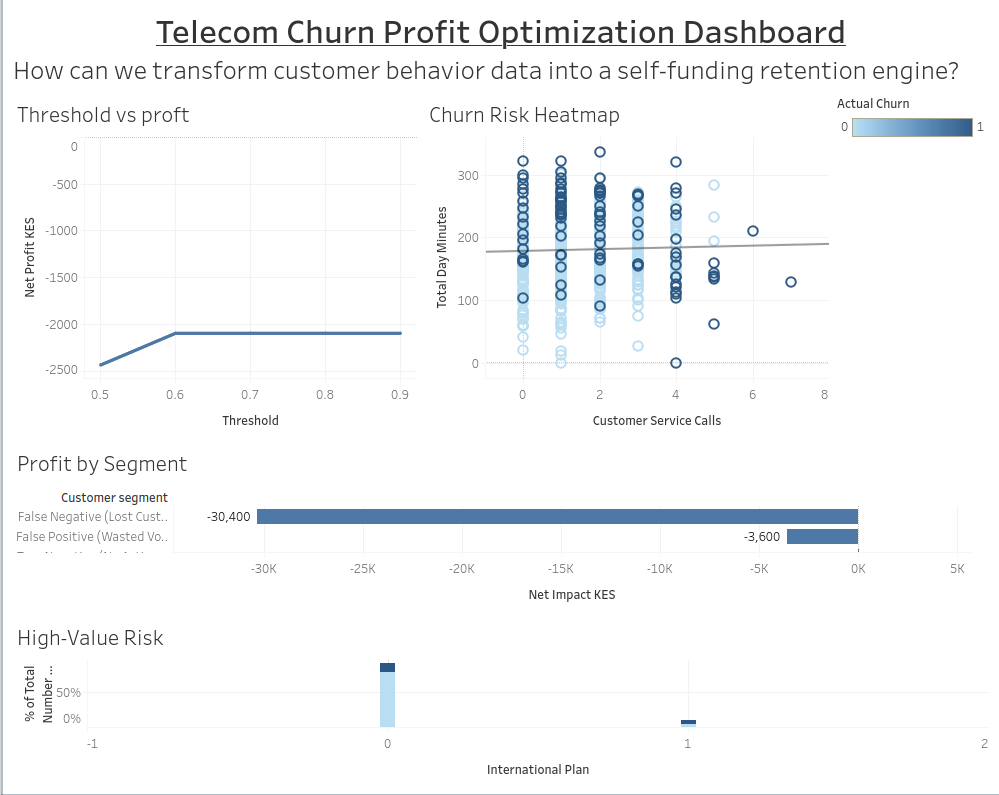

# 📊 Telecom Churn Profit Optimization

**How can we transform customer behavior data into a self-funding retention engine that stops revenue leakage?**

---

## 📌 Project Overview

In the telecommunications industry, retaining an existing customer is significantly more cost-effective than acquiring a new one. This project presents an end-to-end Machine Learning solution to predict customer churn and optimize a retention strategy that maximizes net profit.

Rather than focusing solely on traditional metrics like accuracy, this project introduces a **Business Value Function** to evaluate model performance based on real financial impact.

---

## 🎯 Objectives

* Predict customers likely to churn
* Minimize revenue loss through targeted retention strategies
* Optimize marketing spend using data-driven decisions
* Identify high-risk customer segments

---

## 🧠 Approach

### 1. Data Preparation

* Cleaned and explored telecom customer dataset
* Encoded categorical variables
* Engineered meaningful features:

  * `charge_per_min` → price sensitivity
  * `high_service_user` → customer frustration indicator
  * `day_night_ratio` → behavioral usage pattern

---

### 2. Handling Class Imbalance

* Applied **SMOTE (Synthetic Minority Over-sampling Technique)** to balance churn vs non-churn classes

---

### 3. Modeling

Two models were trained and compared:

* Logistic Regression (baseline model)
* Decision Tree Classifier (interpretable model)

---

### 4. Business Value Function

A custom profit function was designed to evaluate model performance:

* True Positive → Retained customer (profit)
* False Positive → Unnecessary retention cost (loss)
* False Negative → Lost customer (major loss)

This ensures decisions are aligned with **real business impact**, not just accuracy.

---

## 📈 Key Results

* Decision Tree outperformed Logistic Regression in reducing financial loss
* Best model minimized unnecessary retention costs while capturing high-risk customers
* Identified key churn drivers:

  * High customer service calls
  * International plan users
  * High cost per usage patterns

---

## 📊 Tableau Dashboard

An interactive dashboard was built to communicate insights visually:https://public.tableau.com/app/profile/sarah.owendi/viz/TelecomChurnProfitAnalysis/TelecomChurnProfitOptimizationDashboard

### Key Features:

* 💰 Profit Optimization (Threshold tuning)
* 🌡️ Risk Heatmap (Customer behavior patterns)
* 🔲 Confusion Matrix (Model performance)
* 💰 Profit by Segment (True vs False predictions)
* 📊 High-Value Risk Analysis (International Plan users)

---

## 💡 Business Insights

* Customers with frequent service calls are significantly more likely to churn
* International plan users represent a smaller but high-risk segment
* The biggest financial loss comes from **missed churners (False Negatives)**
* Optimizing model thresholds improves overall profitability

---

## 🛠️ Tools & Technologies

* Python (Pandas, NumPy, Scikit-learn)
* Tableau (Data Visualization)
* Jupyter Notebook

---

## 🚀 Future Improvements

* Implement Random Forest / XGBoost for better performance
* Use time-series data to track behavioral changes
* Deploy model as an API for real-time predictions

---

## 📬 Author

**Sarah Owendi**
Data Scientist | Passionate about solving real-world problems using data

---

